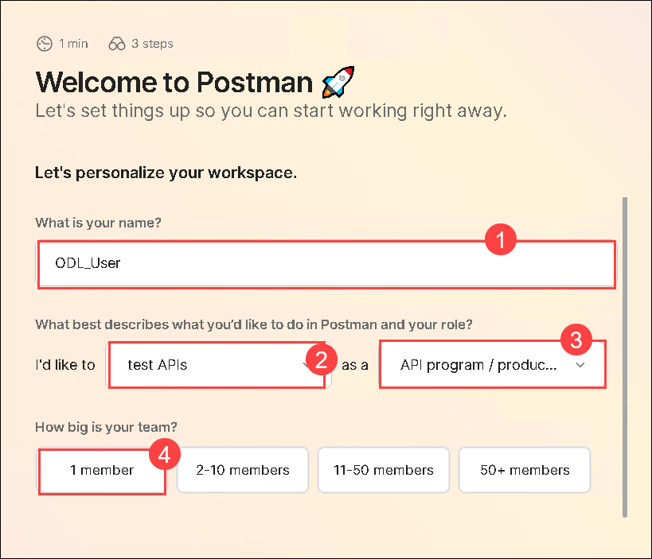
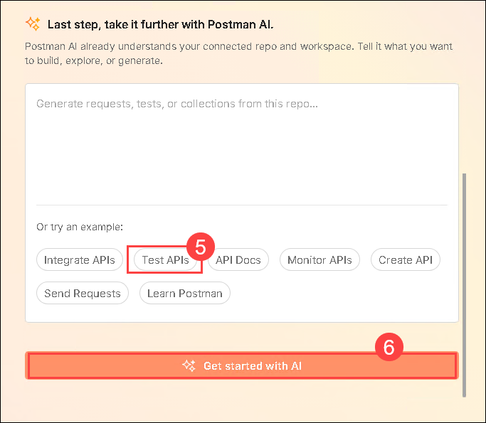
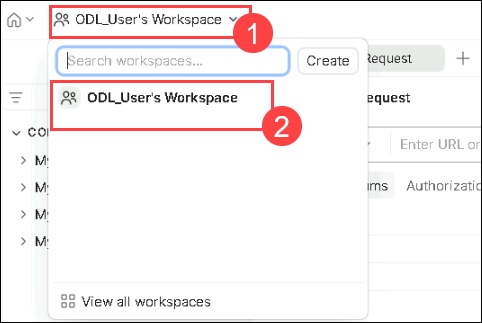
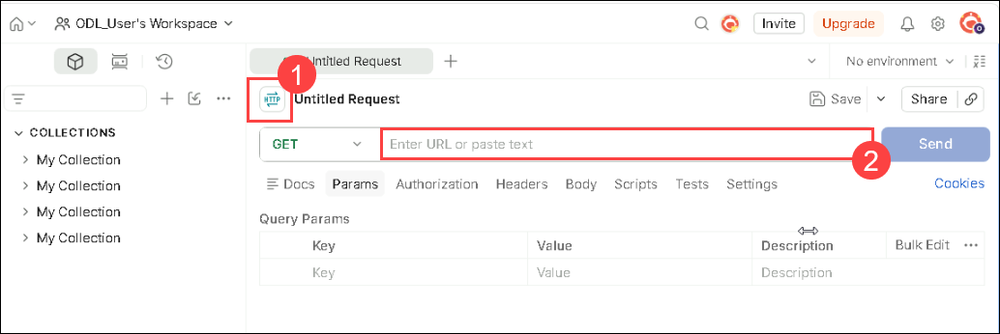

# Exericse 8 Task 4: Self-hosted Gateway

In this task, we will explore the Self-hosted Gateway feature of Azure API Management (APIM).

With the Azure API Management self-hosted gateway, organizations have the ability to deploy an instance of the Azure API Management gateway component to the environments where they host their applications and/or APIs - for example, in an on-premise data center.

The self-hosted gateways are hosted in a Docker or Kubernetes environment and are managed from the Azure API Management service they are connected to.

This part of the lab requires that the user has Docker Desktop installed. we have already pre-installed Docker Desktop in the Jump VM.

There are two terms to become familiar with:

- Gateway Deployment ... This is a set of Azure API Management configuration details that will be used by the Gateway Node(s)
- Gateway Node ... This is a running instance of an Azure API Management gateway proxy i.e. a containerized instance of the gateway

There can be multiple Gateway Deployments and multiple Gateway Nodes.  The Gateway Deployments are chargeable - the Gateway Nodes are free i.e. an organization pays for the management control plane, but the compute is free (you are running on the organization's own hardware)

### Task 4.1: Deploy the Self-hosted Gateway

1. In the **API Management service**, select the **Self-hosted Gateways** **(1)** option from the menu under **Deployment + infrastructure**, and click **+ Add** **(2)**.

    

1. On the **Gateway** page, enter the following details:

    - Name - **OnPremiseGateway** **(1)**
    - Location - **OnPremise** **(2)**
    - Under API, click on **+** and select the required APIs from those that are configured in the Azure API Management instance
    - Our lab will use the **Colors API** **(3)** - this was configured in an earlier module
    - Click on **Add** **(4)** button

      

1. The added Gateway will appear in the list.

   

1. Select the **OnPremiseGateway** gateway from the list, and a blade will appear allowing for further configuration.

1. From the left side menu, under Settings, select the **Deployment (1)** option.

    >**Note:** Here you can find the scripts for deploying on Docker and Kubernetes, for this lab, we will be using the Docker option.

1. Download the **env.conf (2)** file by clicking on it as shown in the below image, and it will be saved automatically in the following path: `C:/Users/demouser/Downloads`. Copy the Docker run command **(3)** under Deployment scripts.

    

   The run command would be like this:
  
    ```text
    docker run -d -p 80:8080 -p 443:8081 --name OnPremiseGateway --env-file env.conf mcr.microsoft.com/azure-api-management/gateway:v2
    ```

1. Launch Docker Desktop by using the shortcut available on the Lab VM desktop. After launching Docker Desktop, **accept the terms**, click on **Skip** to skip the sign in process. Docker Engine may take about 2-3 minutes to start. 

    

    .png)

    >**Note:** If Docker Desktop displays an error saying **WSL needs updating**, copy the suggested command, open PowerShell as an administrator, and run it to update WSL. Once the update is complete, return to Docker Desktop and restart it.

    

    .png)

1. Minimize Docker Desktop and then open the PowerShell in the Lab VM and run the following commands:

    - Navigate to the location where the *env.conf* is located:

      ```
      cd C:/Users/demouser/Downloads
      ```
      ```
      cat env.conf
      ```

    - Run the Docker run command which you copied in the previeos step

      ```
      docker run -d -p 80:8080 -p 443:8081 --name OnPremiseGateway --env-file env.conf mcr.microsoft.com/azure-api-management/gateway:v2
      ```

      

      >**Note:** The first time this is executed, it will need to pull down the Docker image. So there will be a small delay.  Subsequently - if restarted - it will just use the downloaded image.

1. Navigate to the **Gateway** in the Azure portal, and we can see the status in the **Overview** page.. It will show there is one healthy Gateway Node connected to the Deployment. The Gateway Node will keep in sync, and be automatically updated should any of the Gateway Deployment config changes.

    

## Task 4.2: Testing the API

1. Navigate back to the **APIM instance**, click on **Subscriptions (1)** under **APIs** from left pane. Click on the **ellipsis** **(...) (2)** next to the **Unlimited** subscription and select **Show/hide keys (3)**.

    

1. Click on the copy icon to copy the **primary key** and paste it into Notepad for later use.

    
  
1. In the Notepad, copy the URL below and replace **Unlimited-Key** with the primary key that you copied in the previous step.

    ```  
    https://localhost/colors/random?key=Unlimited-Key
    ```

    

1. We will be using Postman to test the API. Open **Postman** using the shortcut on the Lab VM desktop and click on **Create Free Account**.

    

1. Postman will open in a web browser for account creation. Use the **Work email: <inject key="AzureAdUserEmail"></inject> (1)** and **Password: <inject key="AzureAdUserPassword"></inject> (2)**, then click **Create Free Account (3)**.

    

    > **Note**: If you encounter an error like **"Only alphanumeric characters and hyphens are allowed,"** remove any **'*'** or other special characters from the user name.

1. Postman will ask for an OTP during login, go to [**Outlook.com**](https://outlook.com), click **Sign in (1)**, and use the **Username: <inject key="AzureAdUserEmail"></inject>** and **Password: <inject key="AzureAdUserPassword"></inject>** to access the inbox and retrieve the **OTP code (2)** and click on **Verify Account (3)**.

    

     

1. After successful sign-in, on the **This site is trying to open Postman.** pop-up wizard, click **Open**.

    

1. On the **Welcome to Postman!** page, enter **Odl_User (1)** as your name, In I'd like to field select **test APIs (2)** or anything from  the list and choose your role **(3)**, and select the team size as **1 member (4)** after that select any prompt like **Test API (5) and click on **Get Started with AI (6)**

    

     

1. Inside the **Postman**, click on **Workspaces (1)** drop-down and select **odl-user-<inject key="Deployment ID" enableCopy="false" /> (2)** workspace

    

1. On the **My Workspace** page, make sure you selected the **Http (1)** and to request the api you need to add the url link in the **url field (2)**.

    

1. Now, in the **Enter URL or paste text (1)**, enter the URL you copied earlier and select **Send (2)**. Observe the response **(3)**.

    

    .png)

---
## Summary

In this task, you have deployed a self-hosted gateway for Azure API Management, enabling the hosting of API gateway nodes in Docker or Kubernetes environments. Then you have configured the gateway deployment, downloaded configuration files, and executed Docker commands to start the gateway node. Finally, tested the API using Postman, confirming the proper functionality of the self-hosted gateway.

### Now, click on Next from the lower right corner to move on to the next page for further tasks of Exercise 9.

  
